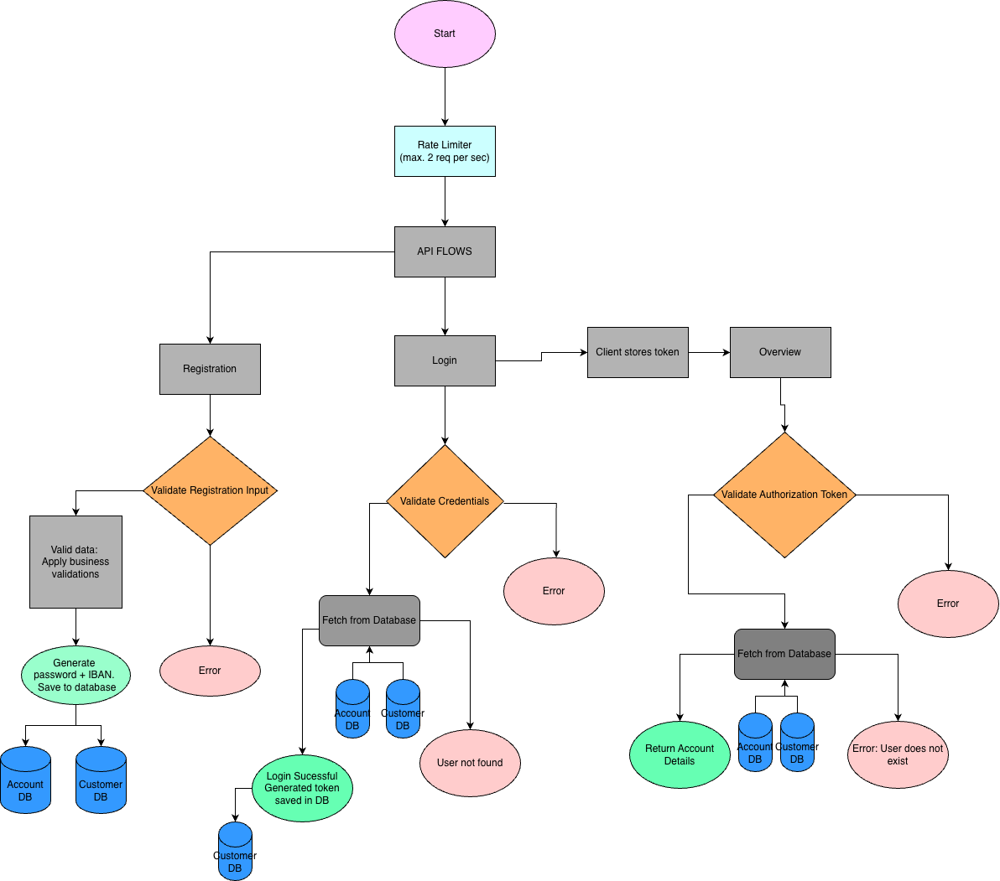

# Bank API

## Overview

This project implements backend REST APIs for a digital banking onboarding system. The goal is to enable customers to register and open an account remotely, eliminating the need for in-branch identity verification.

The application supports the complete onboarding flow:
- Customer registration with validation rules (age, country, unique username)
- Automatic account creation with IBAN generation
- Default credential generation for first-time login
- Customer authentication
- Retrieval of account overview details

The system is designed with simplicity and clarity in mind while addressing key business constraints such as limited database capacity and validation requirements. 
It also includes basic performance considerations (rate limiting) and is structured to allow future improvements like caching and enhanced security.

---

## Features

### 1. Customer Registration

- Register a new customer with name, address, username, date of birth, and country
- Business validations:
    - Username must be unique
    - Only customers from the Netherlands (NL) and Belgium (BE) are allowed
    - Customer must be at least 18 years old
- Automatically generates:
    - Default password for first-time login
    - IBAN account number (format-compliant)

---

### 2. Login

- Authenticate customer using username and generated password
- Handles invalid credentials with appropriate error responses

---

### 3. Account Overview

- Retrieve account details for the logged-in customer
- Requires a valid Authorization token obtained during login
- Returns:
    - IBAN
    - Account type (default: CURRENT)
    - Balance (default: 0.00)
    - Currency (EUR)

---

## Design Decisions

### Registration Validation

Registration rules are handled in the service layer instead of the controller. This keeps the controller focused on HTTP handling and keeps business validation in one place.

Validation includes:
- Unique username check
- Minimum age check
- Supported country check

Database-level uniqueness is also used for username and IBAN to avoid duplicate records.

---

### IBAN Generation

IBAN is generated using:
- Country code (`NL`)
- Random 2-digit check value for format only
- Bank code (`RBAN`)
- Account number based on timestamp + randomness

The database also has a uniqueness constraint on IBAN, and the service checks for duplicates before saving.

Note: Full IBAN checksum validation (`mod-97`) is not implemented to keep the solution simple.

---

### Authentication (Simplified)

A lightweight token-based mechanism is implemented to satisfy the requirement that account data should only be accessible after login.

- On successful login, a random session token is generated
- The token is stored against the customer in the database
- The client must include this token in the `Authorization` header for protected endpoints
- The system validates the token before returning account data
- Tokens do not currently expire and are replaced on each login

This approach keeps the implementation simple while ensuring that endpoints are not publicly accessible.

Note: In a production system, this would be replaced with a more secure approach such as JWT with expiration and proper authentication/authorization layers.

---

### Rate Limiting

A global rate limiter is implemented to handle the constraint of limited database capacity.

- Allows approximately 2 requests per second
- Helps avoid overloading the database
- Swagger/OpenAPI endpoints are excluded so API documentation remains usable

---

### Extensibility for Supported Countries

Country validation is centralized in `CountryService`.

Currently, the supported countries are:
- `NL`
- `BE`

To add another supported country, only the country enum/service validation needs to be updated. This keeps country-related rules separate from registration flow logic.

---

### Error Handling

A global exception handler is used to return consistent error responses across APIs.

Error responses include:
- timestamp
- status code
- message

This keeps API failures predictable and easier to debug.

---

## User Journey



---

## Tech Stack

| Type              | Tools                        |
|-------------------|------------------------------|
| Core Language     | Java 21                      |
| Build Tool        | Maven                        |
| Framework         | Spring Boot, Spring Data JPA |
| Database          | PostgreSQL                   |
| Unit Test         | JUnit & MockMvc              |
| API Documentation | Swagger UI / Open API        |


---

## API Documentation

Swagger UI available at:

[URL To open swagger api in ui edition](http://localhost:8080/swagger-ui/index.html)

OpenAPI specification is available in:

[openapi.yaml](src/main/resources/openapi.yaml)

You can also access the OpenAPI specification in the browser after starting the application:
Open the [open api doc URL](http://localhost:8080/v3/api-docs) 


---

## How to Run


### Running without docker 


### Prerequisites

1. PostgreSQL running locally 
2. Update `application.yaml` with 

- DB_URL
- DB_USERNAME
- DB_PASSWORD

Run:

```bash

mvn clean install

DB_URL=<Database URL> DB_USERNAME=<username> DB_PASSWORD='<password>' mvn clean spring-boot:run

````


or mention the details is command as shown below


Run:

```bash

mvn clean install

DB_URL=<Database URL> DB_USERNAME=<username> DB_PASSWORD='<password>' mvn clean spring-boot:run

```

For this project a sample URL for Postgresql : jdbc:postgresql://localhost:5432/<db_name>

###Running with docker

You can run the application using Docker as an alternative to running it locally.

### Prerequisites

1. Docker installed and running
2. PostgreSQL running locally

---

### Run using script

#### Mac/Linux

1. Make the script executable (only once) this is to give it permission:

`chmod +x run-docker.sh`


2. Run the script:

`./run-docker.sh`


---

#### Windows

Run:

`run-docker.bat`


---

### What the script does

- Builds the application using Maven
- Builds the Docker image
- Runs the container with required environment variables

---

### Environment Variables

The application expects the following environment variables:

- `DB_URL`
- `DB_USERNAME`
- `DB_PASSWORD`

Example:

jdbc:postgresql://host.docker.internal:5432/postgres

These values can be configured in the provided .sh or .bat script files, according to the system on which execution is performed

---

### Access the application

After starting:

- API: http://localhost:8080
- Swagger UI: http://localhost:8080/swagger-ui/index.html

---

### Notes

- `host.docker.internal` is used to allow the Docker container to access the local PostgreSQL instance.
- On Linux, additional configuration may be required for this to work.


---

## Testing

Run tests:

`mvn clean test`


Includes:
- Service layer tests (business logic)
- Controller tests (API behavior)

To view the HTML test report, open in browser:
`target/reports/surefire.html`

---

## Postman collection

A Postman collection is included to test all APIs, including success and error scenarios.

Import the collection:
[Attached Postman Collection](Bank-API-postman-collection.json)

---

## Possible Improvements

- Implement proper IBAN checksum validation (mod-97)
- Add caching (e.g., for `/overview`) to reduce database load
- Replace simple session token with a secure authentication mechanism (e.g., JWT with expiry)
- Improve rate limiting (per user/IP instead of global)
- Improve Docker setup (e.g., containerized PostgreSQL using docker-compose)

---
